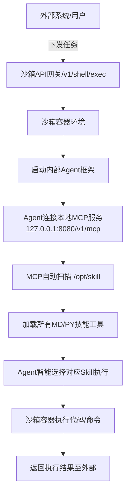

# 沙箱 All\-In\-One\-Box Agent 运行与 MD\-Skill 技能接入技术白皮书

## 1\. 文档概述

### 1\.1 文档目的

本文档用于标准化 **all\-in\-one\-box 一体化沙箱** 的 Agent 部署运行、自定义 Skill 技能接入、MCP 工具调度、任务执行全链路流程。为开发人员、运维人员、算法人员提供统一接入规范、架构认知、部署步骤、故障排查标准。

### 1\.2 适用范围

- all\-in\-one\-box 容器化沙箱环境

- 自定义 Python Agent 框架（沙箱内部运行模式）

- Markdown 结构化 Skill 技能库接入

- 沙箱 MCP 工具自动发现与调度体系

- 外部系统调用沙箱 Agent 任务能力

### 1\.3 核心能力总览

本体系实现：**外部触发 → 沙箱内Agent启动 → 自动加载MD技能 → MCP统一调度工具 → 沙箱容器执行 → 结果回传** 的全闭环私有化隔离运行架构。

## 2\. 系统架构与核心概念

### 2\.1 核心组件说明

|组件名称|作用|运行位置|
|---|---|---|
|all\-in\-one\-box 沙箱|提供隔离容器环境、Shell执行、文件托管、浏览器、Jupyter、MCP服务、进程托管|服务器容器内|
|MCP Server|自动扫描 /opt/skill 目录，解析 MD/Py 技能，注册为大模型可调用工具，提供标准化工具调用协议|沙箱内部常驻服务|
|自定义 Agent 框架|大模型调度核心，负责理解用户任务、选择Skill、调用工具、聚合结果|**沙箱容器内部运行**|
|MD\-Skill 技能库|标准化 Markdown 技能文档，包含工具描述、参数定义、可执行Python代码|沙箱 /opt/skill 目录|
|Supervisor 进程托管|管理沙箱所有常驻服务（MCP、Python\-Server、Nginx、自定义Agent）|沙箱系统底层|

### 2\.2 关键概念澄清（核心区别）

- **Agent 不跑本地，跑沙箱内部**：所有智能体推理、工具调用全部容器内隔离执行，更安全、环境统一。

- **Skill 支持纯 MD 文档格式**：无需复杂配置，Markdown 即可完成工具定义、参数说明、代码挂载。

- **MCP 自动发现技能**：放入 /opt/skill 即可被Agent识别，无需硬编码注册工具。

- **代码包支持 ZIP 整包上传**：支持完整Agent项目批量部署，支持依赖自动安装。

## 3\. 全链路业务流程图（标准流程）

### 3\.1 整体架构流程图



### 3\.2 部署上线流程图


## 4\. 目录规范（强制统一）

为保证MCP自动扫描、进程托管、路径统一，所有代码与技能强制遵循以下目录规范：

- **Agent 框架根目录**：`/opt/agent`

- **Skill 技能统一目录**：`/opt/skill`

- **Supervisor 服务配置目录**：`/opt/gem/supervisord/`

- **临时上传文件目录**：`/tmp`

- **服务日志目录**：`/var/log/`

## 5\. 核心接入规范

### 5\.1 MD\-Skill 技能编写规范（标准模板）

所有自定义技能必须遵循以下 Markdown 格式，MCP 才可自动解析注册为工具。

```markdown
# 工具名称: xxx_tool_name
## 功能描述
此处填写工具能力、适用场景、用途说明

## 入参定义
- param1: 类型 | 含义 | 是否必填
- param2: 类型 | 含义 | 是否必填

## 返回值定义
- result: 结果数据结构说明

## 执行脚本
```python
def run(param1, param2):
    # 工具核心逻辑
    return {"code":0, "data":"执行结果"}
```

```

核心要求：**必须存在 run\(\) 入口函数**，MCP 通过反射调用该函数执行技能。

### 5\.2 Agent 框架接入规范

- Agent 运行于沙箱内部，MCP 连接地址固定：`http://127.0.0.1:8080/v1/mcp`

- Agent 启动目录固定为：`/opt/agent`

- 必须支持命令行传入任务参数，适配沙箱 Shell 调用方式

- 输出结果标准化 JSON/结构化文本，方便外部系统解析

## 6\. 全流程部署操作手册

### 6\.1 Agent 整包部署流程（ZIP 自动上传方案）

适用于完整Agent项目、多文件框架、带依赖的工程。

1. 本地将 Agent 所有代码打包为 `agent.zip`（根目录直接是项目文件，无外层文件夹）

2. 使用专用上传工具脚本：Base64 上传 ZIP 至沙箱 /tmp

3. 沙箱自动解压至 /opt/agent

4. 自动执行 pip 安装全部依赖

5. 测试运行 Agent 验证环境正常

### 6\.2 MD 技能上传流程

1. 按照规范编写 xxx\.md 技能文件

2. 调用 /v1/file/write 上传至 /opt/skill/

3. 执行 `supervisorctl restart mcp-server-browser`

4. MCP 刷新工具列表，Agent 可自动发现并调用

### 6\.3 两种 Agent 运行模式

#### 模式1：单次临时运行（测试/短任务）

通过沙箱 Shell 接口临时拉起进程，任务结束自动销毁，无需托管。

```bash
curl -X POST http://127.0.0.1:8080/v1/shell/exec \
-d '{"command":"python3 /opt/agent/main.py \"任务指令\"","exec_dir":"/opt/agent"}'

```

#### 模式2：后台常驻服务（生产长期运行）

通过 Supervisor 托管，沙箱开机自启、崩溃自动重启。

1. 上传自定义 agent\.conf 至 supervisord 配置目录

2. 执行 supervisorctl update 加载配置

3. 启动自定义 Agent 进程

4. 通过日志查看运行状态

## 7\. 核心API能力对照表

|接口|用途|
|---|---|
|POST /v1/file/write|上传单文件/MD技能/配置/Base64压缩包|
|POST /v1/shell/exec|执行任意Shell命令、启动Agent、安装依赖、重启服务|
|POST /v1/file/list|查看沙箱内Agent/Skill文件列表|
|POST /v1/file/rm|删除旧代码、旧技能文件|

## 8\. 故障排查与已知问题

### 8\.1 python\-server SIGILL 崩溃问题

**现象**：python\-server 反复非法指令崩溃、FATAL 状态

**影响**：Jupyter 接口、部分MCP高级能力失效

**临时规避**：使用 /v1/shell/exec 直接运行Agent与Skill，不依赖内置python\-server

**根治方案**：统一CPU架构、重新构建兼容镜像

### 8\.2 MCP 无法识别新上传MD技能

**原因**：MCP服务不会自动热加载

**解决**：新增/修改技能后必须重启 MCP 服务

### 8\.3 Agent 找不到技能文件

**规范问题**：技能必须放在 /opt/skill，Agent工作目录必须指定 /opt/agent

## 9\. 上线标准验收项

- Agent 整包可一键上传、解压、装依赖、正常启动

- MD 技能可被 MCP 正常识别、工具列表可见

- Agent 可自动调用 MD 技能并返回正确结果

- 常驻模式可自启动、崩溃重启、日志正常输出

- 外部 API 可正常触发 Agent 任务执行

## 10\. 附录：一键部署工具说明

配套提供 Python 自动化工具，支持：

- Agent ZIP 整包一键上传解压

- MD 技能批量上传

- MCP 自动重启

- Agent 任务一键测试运行

> （注：部分内容可能由 AI 生成）
